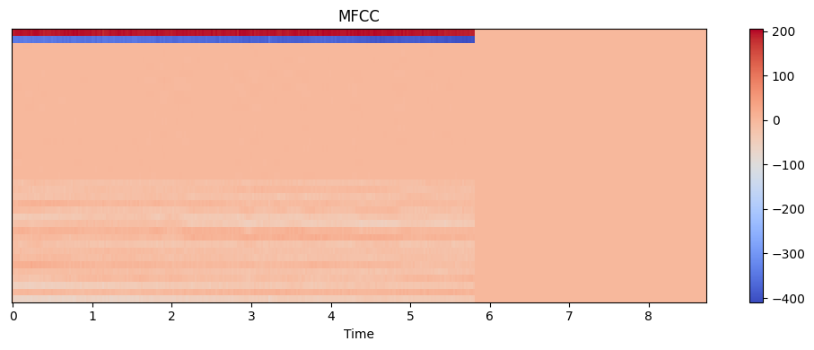

# Folder Structure

說明資料夾與程式檔案的用途

- `analysis` 存放資料分析的產出及程式檔案
- `data` 存放官方提供的資料及處理後的資料
- `models` 存放訓練完畢的模型及權重檔案
- `images` 存放用於 Markdown 的圖檔
- `submission` 存放 Public 及 Private 階段的提交檔案
- `acoustic.py` 使用聲音特徵進行預測的模型

# Method

說明主要的方法與架構，更多實驗細節紀錄在後續章節

## Data Pre-Processing

說明資料前處理的方法

參考官方範例程式碼，將音訊檔案以 44100 的取樣率讀取後，轉換為 40 個 MFCC 特徵，並且由於音檔的長度可能不同，將所有音檔的長度以 0 補足至 376 個時間點

| MFCC 特徵長度 | 資料筆數 |
| ------------- | -------- |
| 126           | 39       |
| 188           | 16       |
| 251           | 327      |
| 376           | 618      |


## Data Augmentation

說明資料擴增的方法

進行模型訓練的時候，會隨機將 MFCC 特徵套用以下的資料擴增方法：

### Time Shift

將 MFCC 特徵向右或向左平移，平移的距離隨機產生，平移的過程中，超出範圍的部分會銜接在另一端，如下圖所示：


### Pitch Shift

將 MFCC 特徵的頻率向上或向下平移，平移的距離隨機產生，平移的過程中，超出範圍的部分會銜接再另一端，如下圖所示：



### Noise

將 MFCC 特徵加上隨機產生的雜訊，雜訊的強度隨機產生，如下圖所示：


## Data Split

說明資料的拆分策略

在 Training 階段將全部 1000 筆資料依據 Disease Category 等比例切分為 5 等份，進行 5 Fold Cross Validation，每次使用其中 1 份資料做為測試集，其餘 4 份資料做為訓練集，模型訓練的時候再從訓練集中切分出 10% 的資料做為驗證集

## Deep Learning Model

說明深度學習模型的架構

使用 1D Convolutional Neural Network 作為主要的模型架構，用於提取音訊的特徵，並且由於 MFCC 特徵有時間序列的特性，因此在卷積後加入 Bidirectional LSTM 學習音訊特徵的前後關係，最後使用 Dense Layer 作為模型的輸出層，用於分類

```python
augmentation_layer = tf.keras.layers.Lambda(augment_audio)
model = tf.keras.Sequential()
model.add(tf.keras.layers.Input(shape=input_shape))
if isAugmentationActivated:
    model.add(augmentation_layer)
model.add(tf.keras.layers.Conv1D(64, 3, activation='relu', padding='same'))
model.add(tf.keras.layers.BatchNormalization())
model.add(tf.keras.layers.MaxPooling1D(2))
model.add(tf.keras.layers.Conv1D(128, 3, activation='relu', padding='same'))
model.add(tf.keras.layers.BatchNormalization())
model.add(tf.keras.layers.MaxPooling1D(2))
model.add(tf.keras.layers.Conv1D(256, 3, activation='relu', padding='same'))
model.add(tf.keras.layers.BatchNormalization())
model.add(tf.keras.layers.MaxPooling1D(2))
model.add(tf.keras.layers.Conv1D(512, 3, activation='relu', padding='same'))
model.add(tf.keras.layers.BatchNormalization())
model.add(tf.keras.layers.MaxPooling1D(2))
model.add(tf.keras.layers.Bidirectional(tf.keras.layers.LSTM(256, return_sequences=True)))
model.add(tf.keras.layers.Bidirectional(tf.keras.layers.LSTM(128)))
model.add(tf.keras.layers.Dense(512, activation='relu'))
model.add(tf.keras.layers.BatchNormalization())
model.add(tf.keras.layers.Dropout(dropout))
model.add(tf.keras.layers.Dense(256, activation='relu'))
model.add(tf.keras.layers.BatchNormalization())
model.add(tf.keras.layers.Dropout(dropout))
model.add(tf.keras.layers.Dense(5, activation='softmax'))
```

訓練過程中，採用 Categorical Cross Entropy 作為 Loss Function；此外，若 Loss 在持續 25 個 Epoch 內沒有下降，就將 Learning Rate 設為當前的 0.31 倍，若 Loss 在持續 50 個 Epoch 內沒有下降，就停止訓練；訓練結束後，會將訓練階段在驗證集擁有最佳表現之 Epoch 的權重作為模型的最終權重，模型的其餘參數包括：

- BatchSize 設為 32
- 優化器使用 Adam
- 學習率設為 1e-4
- Epoch 設為 300
- Earlystop 機制設為 50 個 Epoch

# Experiment Result

紀錄並分析實驗的結果

實驗績效為 5 Fold Cross Validation 對共 1000 筆資料進行預測的結果

| item | experiment                            | test.ura | public.ura |
| ---- | :------------------------------------ | -------- | ---------- |
| 1    | base                                  | 0.34     |            |
| 2    | base_augmentation(pitch)              | 0.36     |            |
| 3    | base_augmentation(pitch,noise)        | 0.37     | 0.371825   |
| 4    | base_augmentation(pitch,time)         | 0.30     |            |
| 5    | base_augmentation(pitch, noise, time) | 0.24     |            |

使用基本 Base 模型在 5 Fold Cross Validation 的測試績效為 0.34，為了提升模型的績效，嘗試了 4 種不同的資料增強策略，結果如上表所示，其中實驗 3 的績效最好，因此選擇實驗 3 的模型作為最終的模型，而該模型在 Public Leaderboard 的績效為 0.371825

下圖為實驗 3 的模型在訓練過程中的 Loss 與 Recall 變化，可以看到模型在訓練集的 Loss 與 Recall 都有不錯表現，然而在驗證集的 Recall 卻在 0.60 以後就不見增長，這表示模型在訓練集上有過擬合的現象，或許未來可以嘗試加入更多的資料增強策略，或是使用更多的資料來訓練模型


由於我個人的模型績效不太理想，因此在這個競賽，我們最終使用 [@Tsao666](https://github.com/Tsao666) 訓練的模型進行提交